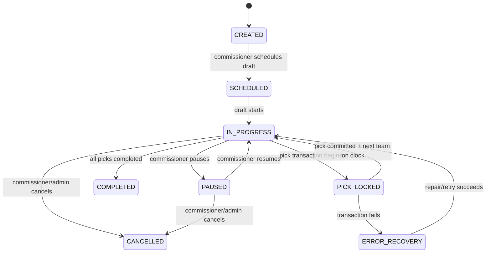
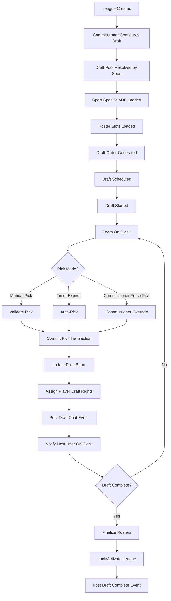
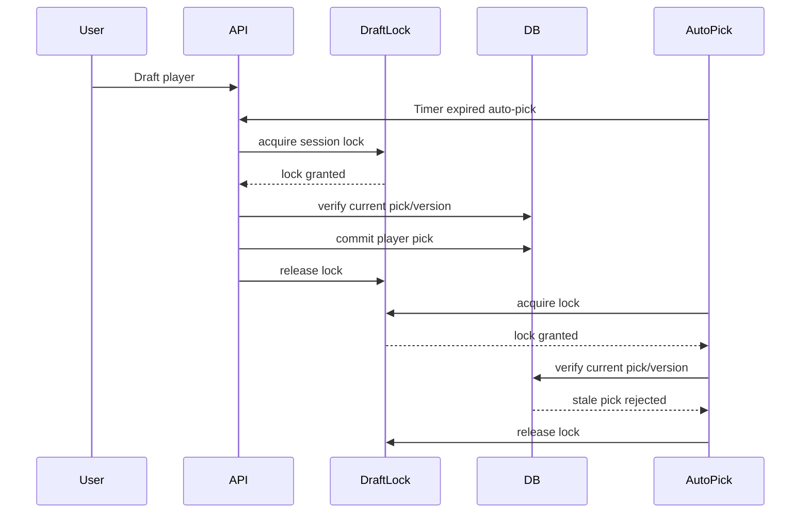
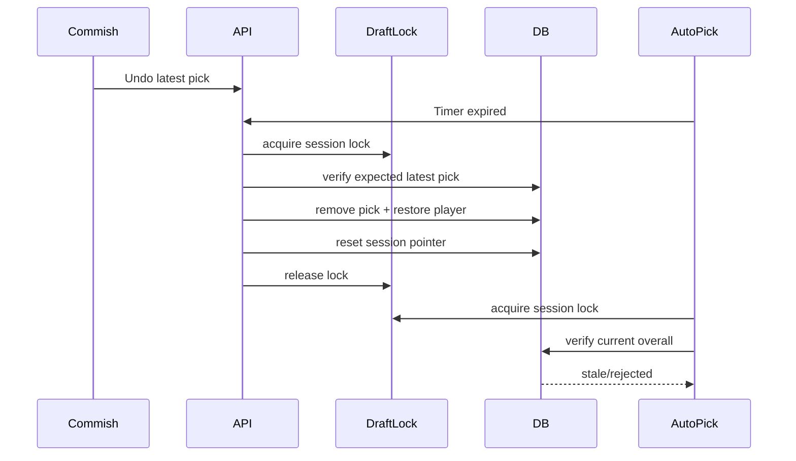
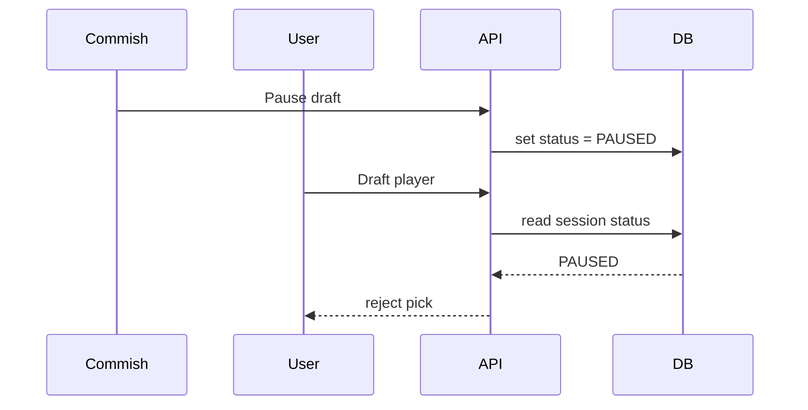
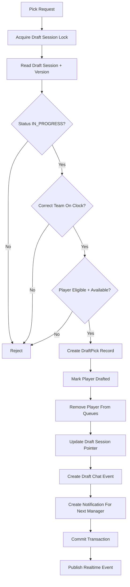
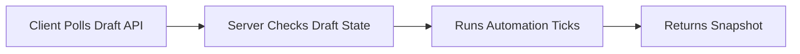
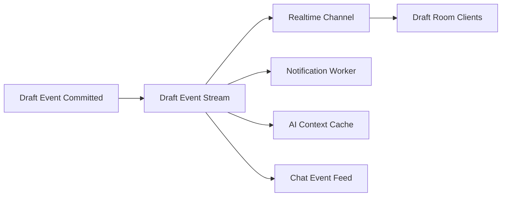
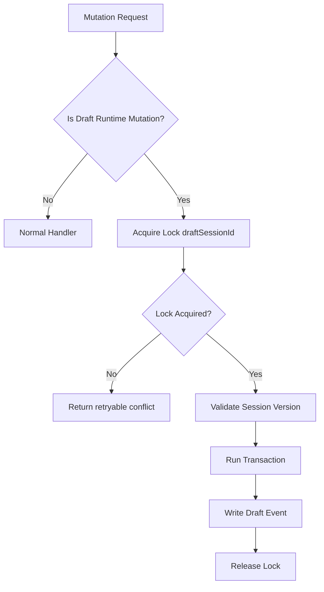
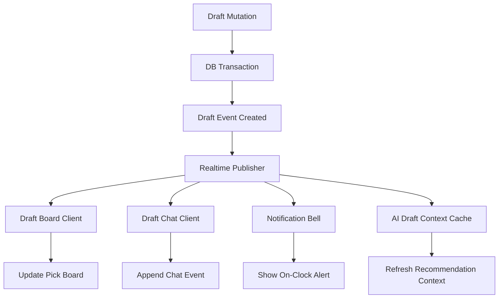

# AllFantasy Draft Runtime Architecture Pack

## 1. Draft State Machine



**Rule:** No manual pick, auto-pick, or AI-assisted pick may commit unless state is `IN_PROGRESS`.

Paused drafts may allow:

- queue edits
- chat
- commissioner messages
- trades if allowed

Paused drafts must block:

- normal picks
- expired timer autopicks
- AI autopicks

---

## 2. Draft Session Lifecycle Map



---

## 3. Race-Condition Sequences

### Manual Pick vs Auto-Pick



### Undo Pick vs Auto-Pick



### Pause vs Pick



**Launch rule:** This must be enforced server-side, not only in the UI.

---

## 4. DB Transaction Flow Chart



**Important:** AI recommendations, chat fan-out, emails, SMS, and heavy notifications should not block the pick transaction.

---

## 5. WebSocket / Realtime Migration Strategy

### Current Model



### Target Model



### Migration Phases

**Phase 1**

- Keep polling.
- Add stronger locks and idempotency.

**Phase 2**

- Add draft event stream table.
- Every pick/pause/resume/undo/trade creates an event.

**Phase 3**

- Add WebSocket/realtime subscriptions.
- Clients update board from events.

**Phase 4**

- Polling becomes fallback only.

---

## 6. Event-Sourcing Recommendation

Use an append-only `draft_events` table.

Suggested event types:

```ts
type DraftEventType =
  | "DRAFT_STARTED"
  | "DRAFT_PAUSED"
  | "DRAFT_RESUMED"
  | "PICK_MADE"
  | "AUTO_PICK_MADE"
  | "PICK_UNDONE"
  | "TRADE_PROPOSED"
  | "TRADE_ACCEPTED"
  | "TRADE_REJECTED"
  | "TIMER_EXPIRED"
  | "QUEUE_UPDATED"
  | "USER_ON_CLOCK"
  | "DRAFT_COMPLETED";
```

Each event should include:

```ts
{
  id: string;
  draftSessionId: string;
  leagueId: string;
  eventType: DraftEventType;
  actorUserId?: string;
  teamId?: string;
  overallPick?: number;
  round?: number;
  payload: Json;
  createdAt: Date;
  idempotencyKey: string;
}
```

Benefits:

- easier replay
- easier debugging
- better chat sync
- better notification sync
- safer recovery after failures
- easier Sleeper-style realtime UX

---

## 7. Lock Strategy Recommendation

Use a single authoritative draft mutation lock.



Runtime mutations requiring lock:

- manual pick
- auto-pick
- undo pick
- pause
- resume
- trade accept
- trade cancel
- force pick
- draft completion

Queue editing does **not** need the same lock unless the user is currently on clock and auto-pick is executing.

---

## 8. Realtime Synchronization Architecture



Client should subscribe to:

- `draft:{draftSessionId}:board`
- `draft:{draftSessionId}:chat`
- `draft:{draftSessionId}:timer`
- `user:{userId}:notifications`

---

# Phase Rollout

## Phase 1 — Integrity

Must finish before beta.

1. Rotate exposed secrets.
2. Enforce paused pick hard-stop.
3. Add idempotency keys.
4. Add draft mutation lock.
5. Add DB uniqueness constraints.
6. Normalize AF Pro AI entitlement.
7. Add race-condition tests.

---

## Phase 2 — Sleeper Parity

1. Timer-after-trade behavior.
2. Undo pick behavior.
3. Queue editing while paused.
4. On-clock notifications.
5. Draft chat event reliability.
6. NCAA roster parity.
7. Soccer/Fantrax roster verification.

---

## Phase 3 — Scale

1. Add draft event stream.
2. Add realtime board updates.
3. Reduce polling.
4. Batch notifications.
5. Cache AI recommendations.
6. Move slow side effects off pick path.

---

## Phase 4 — Advanced Features

1. Live drafted-player trades.
2. AI trend-based queue recommendations.
3. AI roster-need analysis.
4. AI draft recap.
5. Commissioner recovery dashboard.
6. Full replay/debug draft timeline.

---

# Launch Gates

Do not beta launch until all are true:

- Pause hard-stop passes server-side tests.
- Manual pick vs auto-pick race test passes.
- Undo vs auto-pick race test passes.
- Trade accept vs timer expiry test passes.
- Draft completion assigns all rosters correctly.
- Draft chat events appear correctly.
- On-clock notification works.
- AI draft tools are AF Pro gated.
- NCAA roster parity passes.
- Soccer roster eligibility passes.
- p95 pick confirmation time is acceptable.
- secrets are rotated and secret scanning is enabled.
